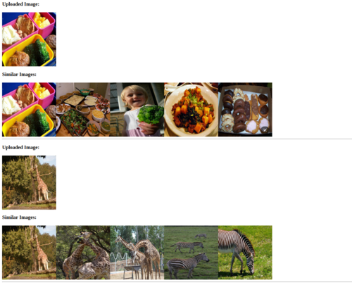
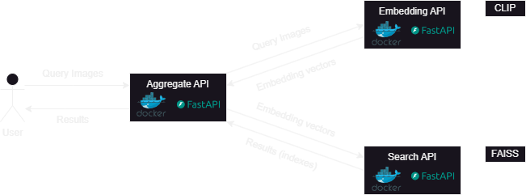

# Image-to-Image Search Service

## Overview

This project is part of the CinnamonAI Bootcamp (Week 3, Day 2) assignment. It implements an image-to-image search service using the COCO 128 dataset. The system uses CLIP for image encoding and FAISS for the search algorithm.

## Interface

We developed a simple interface using HTML



## System Design




The project consists of three main API services:

1. **Embedding API**: Extracts image embeddings using the CLIP model.
2. **Search API**: Performs similarity search using FAISS.
3. **Aggregate API**: Orchestrates the process and handles user requests.

### Workflow

1. User sends image(s) to the Aggregate API.
2. Aggregate API forwards the image(s) to the Embedding API.
3. Embedding API returns embedding vector(s).
4. Aggregate API sends the vector(s) to the Search API.
5. Search API returns the indexes of the top 5 most similar images for each vector.
6. Aggregate API retrieves the corresponding images from storage and returns them to the user.

## Features

- Multi-image input support
- Top-5 similar images returned for each input image
- Containerized services
- Deployed on AWS

## Technologies Used

- FastAPI
- Docker
- CLIP (for image encoding)
- FAISS (for similarity search)
- AWS EC2 (for deployment)
- CI + Pre-commit hooks

## API Endpoints

### 1. Embedding API

- **Input**: List of images (BytesIO format)
- **Output**: List of embedding vectors (numpy arrays)
- **Endpoint**: `/embed-image`

### 2. Search API

- **Input**: List of embedding vectors
- **Output**: List of lists containing top 5 image indexes
- **Endpoint**: `/search`

### 3. Aggregate API

- **Input**: One or more images
- **Output**: Top 5 most similar images for each input image
- **Endpoint**: `/`

## Setup & Deployment

Firstly, please download the `COCO 128` dataset and create the `index.faiss` and `image_paths.json` file by running the notebook `notebooks/create_faiss_index.ipynb` and save to folder `./data` with the following structure:
```
└── data/
    ├── coco-128/
    │   └── train
    ├── uploads/
    ├── image_paths.json
    └── index.faiss
```

Secondly, fill in the variable values in `.env.example` file and remember to rename this file to `.env`:
- `IMAGES_PATH_FILE`: path to created `image_paths.json` file
- `INDEX_SAVE_PATH`: path to created `index.faiss` file
- `UPLOAD_DIR`: path to folder to save users' upload images

Deploy the services using docker compose:
```bash
docker compose up -d
```

## Code Quality

We maintain high code quality standards through:
- Continuous Integration (CI)
- Code conventions
- Docstrings
- Pre-commit hooks
